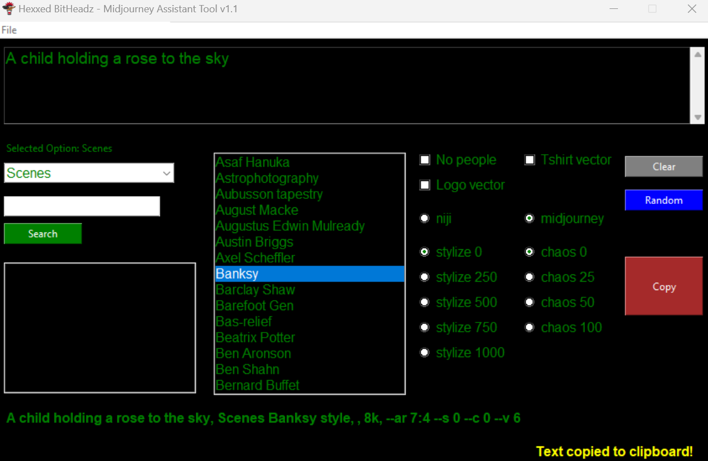
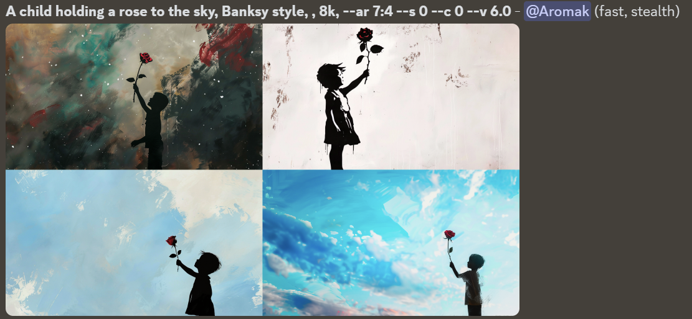

# MAT
Midjourney Assistant Tool v2.3
Welcome to MAT 2.3 UPDATE!  See below for new features!
-Log button in toolbar: Logs previous prompt entires, double click for quick copy
-Search update: Now uses sort | uniq to eliminate duplicate results
-draft mode: Now able to include draft mode, which results in lower resolution and faster results
-repeat: Since when was this a thing?!  Now able to select few options in drop down to build prompt with repeat!
-Live preview window: Upgraded whimpy label to live preview mode at the bottom, dynamically displaying your beautiful prompt in real-friggin-time yo!

>>>OLD NEWS>>>

Midjourney Assistant Tool v1.1

Welcome to MAT 1.1 UPDATE!  See below for new features!

I find myself using Midjourney a lot. I decided to create a small tool that would help me with staging recurring selections. So, I made this tool where I can simply insert my prompt, quickly select some frequent options and copy to paste into midjourney. 

Features include: 
    - The save feature has been completely revamed, stores input and GUI selections into a json file (NEW) 
    - No more shit load of listboxes!  Now start with a drop down menu, then select specific style (NEW) 
    - Can't find a specific style you know is there?  Search function now help you! (NEW) 
    - New radio buttons to test out 0/50/75/100 chaos options (NEW) 
    - My personal favorite, the random fucntionality completley reworked to select a style for you! (NEW) 
    - The "No people" option attempts to remove any people from your art. 
    - The "T-shirt vector" option aims to make art more suitable for shirts and also tries to apply a black background. 
    - The "Logo vector" option aims to make art more suitable for creating logos also tries to apply a black background. 
    - There are radio buttons for Niji or Midjourney. 
    - There are radio buttons for 0/250/500/750/1000 stylize options.

MAT             |  Midjourney
:-------------------------:|:-------------------------:
  |  

Search             |
:-------------------------:

